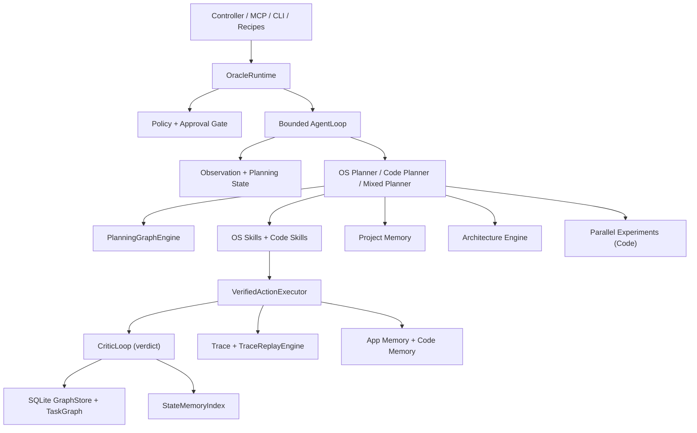

<<<<<<< HEAD
<div align="center">


# Oracle OS

**A safe, local macOS operator runtime with a shared dual-agent substrate.**

[](LICENSE)
[]()
[](https://swift.org)
[]()

[Quick Start](#-quick-start) · [Features](#-features) · [Architecture](#-architecture) · [MCP Tools](#-mcp-tool-surface) · [Contributing](CONTRIBUTING.md)

</div>

---

Oracle OS runs two agents on a single execution core — one controls your Mac, the other writes your code — sharing a unified trust boundary, policy engine, and verified execution path.

<div align="center">

| | |
|:---:|:---:|
|  |  |
| *macOS operator agent in action* | *Replayable recipe execution* |

</div>

## 📖 Table of Contents

- [Quick Start](#-quick-start)
- [Features](#-features)
- [Architecture](#-architecture)
- [Safety Model](#-safety-model)
- [MCP Tool Surface](#-mcp-tool-surface)
- [Oracle Controller](#-oracle-controller)
- [How It Works](#-how-it-works)
- [Repository Layout](#-repository-layout)
- [Development](#-development)
- [Roadmap](#-roadmap)
- [Contributing](#-contributing)
- [License](#-license)

## 🚀 Quick Start

```bash
# Clone and build
git clone https://github.com/dawsonblock/Oracle-OS.git
cd Oracle-OS
swift build

- 22 public MCP tools remain available under stable `oracle_*` names
- native local controller and bundled host process are working
- verified execution is active for the core interaction actions
- canonical observation snapshots are real and used by runtime logic
- planning-state abstraction is implemented and used as reusable graph state
- graph persistence is SQLite-backed
- policy and approval gating are active runtime concerns, not just scaffolding
- code-domain execution uses a workspace-scoped runner instead of unsafe shell UI control
- project memory, experiment fanout, and architecture review are implemented as bounded upper layers
- Reasoning Layer: Multi-coordinator architecture for decision, execution, learning, and recovery
# First-time setup
./.build/debug/oracle setup
./.build/debug/oracle doctor
```

> **Requirements:** macOS 14+, Swift 5.9+, Accessibility and Screen Recording permissions.

## ✨ Features

### 🖥️ macOS Operator Agent

Control apps, browsers, windows, and files through safe, verified action paths.

- **AX-first perception** — inspect UI state, capture screenshots and element context
- **Verified interactions** — click, type, press, focus, scroll, and window-manage with pre/post observation checks
- **Replayable recipes** — automate multi-step workflows as portable JSON
- **Policy & approval gating** — risky actions require explicit approval before execution

### 💻 Software Engineer Agent

Read code, edit files, run builds and tests — all scoped to your workspace.

- **Repository intelligence** — index structure, symbols, dependencies, and tests
- **Workspace-scoped execution** — file edits, builds, tests, and git ops without unsafe shell automation
- **Bounded experiments** — fan out candidate fixes in isolated git worktrees, ranked and replayed
- **Project memory** — retrieve prior design decisions and avoid already-failed approaches

### 🔗 Shared Substrate

Both agents share one runtime, one policy engine, one verified execution boundary, one trace system, one graph store, and one memory layer.

## 🏗 Architecture



Every action flows through:

> **Observe → Abstract → Plan → Gate → Execute → Trace → Learn**

This makes the system slower to overclaim and harder to poison with weak evidence. For full details see [ARCHITECTURE.md](ARCHITECTURE.md).

<details>
<summary><strong>Core runtime layers</strong></summary>

#### Observation & Planning State

`ObservationBuilder` and `ObservationFusion` produce canonical observations. `StateAbstraction` reduces them into reusable planning state — preventing DOM drift from exploding state cardinality and giving graph edges stable node identity.

#### Verified Execution

`VerifiedActionExecutor` is the core trust boundary. Each step includes pre/post observation capture, hashing, action execution, postcondition verification, failure classification, and trace recording.

#### Graph Learning

Transitions are recorded into a SQLite-backed graph with tiered knowledge: `exploration` → `candidate` → `stable`. Experiment and recovery evidence cannot promote directly to stable — only trusted, replayed outcomes earn that tier.

#### Dual-Agent Runtime

OS-domain planning (graph-backed UI interaction, ranked targets, verified execution) and code-domain planning (repo indexing, patch/build/test loops, workspace-scoped execution) hand off seamlessly in one bounded loop.

</details>

## 🛡 Safety Model

Oracle OS is intentionally conservative. Ambiguous policy states fail closed.

| | Examples |
|---|---|
| ✅ **Allowed** | Observation, inspection, safe navigation, workspace reads, local build/test/lint, safe git (`status`, `diff`, `branch`, `commit`) |
| 🔐 **Approval-gated** | Send/submit flows, purchase interactions, destructive file ops, `git push`, sensitive config changes |
| 🚫 **Blocked** | Terminal/shell UI control, arbitrary shell strings, writes outside workspace, force push, system file mutation |

<details>
<summary><strong>Governance contract</strong></summary>

- One hard execution truth path
- Reusable knowledge separated from episode residue
- Hierarchical planning with local execution
- Recovery treated as a first-class mode
- Architecture growth gated by eval and governance coverage

See [GOVERNANCE.md](GOVERNANCE.md) for the full normative contract.

</details>

## 🔌 MCP Tool Surface

Oracle OS exposes **22 stable public MCP tools** under `oracle_*` names:

| Category | Tools |
|---|---|
| **Perception** | `oracle_context` · `oracle_state` · `oracle_find` · `oracle_read` · `oracle_inspect` · `oracle_element_at` · `oracle_screenshot` |
| **Actions** | `oracle_click` · `oracle_type` · `oracle_press` · `oracle_hotkey` · `oracle_scroll` · `oracle_focus` · `oracle_window` |
| **Vision** | `oracle_ground` · `oracle_parse_screen` |
| **Diaoracle-os** | `oracle_wait` · `oracle_permissions` · `oracle_doctor` |
| **Recipes** | `oracle_recipes` · `oracle_run` · `oracle_recipe_show` · `oracle_recipe_save` · `oracle_recipe_delete` |

## 🎛 Oracle Controller

A native local macOS controller for supervised operation.

```bash
# From source
swift build && open OracleController.xcworkspace

# Packaged app
./scripts/build-controller-app.sh --configuration release
./scripts/create-controller-dmg.sh --configuration release
```

The controller surfaces operator controls, recipe execution, trace inspection, policy approvals, experiment metadata, project-memory references, and architecture findings. First launch guides you through Accessibility, Screen Recording, and optional vision setup.

More details: [docs/oracle-controller.md](docs/oracle-controller.md)

## ⚙️ How It Works

<details>
<summary><strong>macOS task execution</strong></summary>

1. Observe the frontmost app and UI state
2. Abstract the state into reusable planning state
3. Query graph-backed or exploration-backed planner
4. Resolve targets through ranking
5. Gate the action through policy
6. Execute through verified execution
7. Classify success / failure
8. Record trace and update graph / memory

</details>

<details>
<summary><strong>Code task execution</strong></summary>

1. Classify the goal as code-domain or mixed
2. Index the current workspace
3. Retrieve relevant project-memory records
4. Run architecture review if the change looks high-impact
5. Choose a direct step or escalate to bounded experiments
6. Execute through the workspace-scoped runner
7. Replay the selected winner through the primary runtime path
8. Record trace, graph, and memory updates

</details>

<details>
<summary><strong>Project memory</strong></summary>

Engineering memory — not chat memory. Canonical Markdown in [`ProjectMemory/`](ProjectMemory) covering architecture decisions, open problems, rejected approaches, known-good patterns, risks, and roadmap state. The runtime writes draft records only; promotion to accepted memory is deliberate.

</details>

<details>
<summary><strong>Parallel experiments</strong></summary>

Code tasks fan out into bounded candidate experiments (default: 3) using git worktrees. Candidates are ranked by: passing build/tests → fewer touched files → smaller diff → lower architecture risk → lower latency. Only the selected candidate, replayed in the primary workspace, can become stable graph knowledge.

</details>

## 📁 Repository Layout

```text
ProjectMemory/                  canonical project memory
Sources/OracleOS/
  Runtime/                      runtime spine, loop, routing, task context
  Core/
    Observation/                canonical observations and fusion
    PlanningState/              reusable planning state abstraction
    Execution/                  verified execution boundary + critic integration
    ExecutionSemantics/         action contracts and verified transitions
    Policy/                     gating and approvals
    Ranking/                    ranked target resolution
    Trace/                      structured traces and artifacts
    World/                      shared world view
  StateAbstraction/             compressed semantic UI state
  ActionSchema/                 typed action schemas with pre/postconditions
  Critic/                       self-evaluation loop (SUCCESS/PARTIAL/FAILURE/UNKNOWN)
  PlanningGraph/                deterministic planning graph for action selection
  TraceReplay/                  execution replay and divergence detection
  StateMemory/                  compressed state caching and reuse
  Graph/                        candidate/stable graph + SQLite persistence
  TaskGraph/                    runtime task tracking
  CodeExecution/                workspace-scoped command runner
  CodeIntelligence/             repository indexing and structural queries
  Experiments/                  git worktree experiment fanout
  Architecture/                 advisory architecture analysis
  ProjectMemory/                runtime-facing project-memory index/query/store
  Agent/
    Planning/                   OS/code/mixed planning
    Skills/                     OS skills and code skills
    Recovery/                   runtime and code recovery logic
  Learning/Memory/              lightweight bias memory
  MCP/                          MCP surface
Sources/OracleController/       native local controller UI
Sources/OracleControllerHost/   local host process for controller
Tests/OracleOSTests/            unit/runtime contract tests
Tests/OracleOSEvals/            repeated task eval harness with baseline regression detection
```

## 🔧 Development

```bash
swift build                    # build the project
swift test                     # run tests
open OracleController.xcworkspace   # open controller in Xcode

# CLI commands
./.build/debug/oracle setup    # first-time setup
./.build/debug/oracle doctor   # check system health
./.build/debug/oracle status   # runtime status
./.build/debug/oracle version  # version info

# Packaged app (unsigned debug build)
./scripts/build-controller-app.sh --configuration debug --skip-sign
./scripts/create-controller-dmg.sh --configuration debug --skip-sign
```

## 🗺 Roadmap

Oracle OS is on the path from **safe local operator + bounded coding agent** toward a **project-carrying engineering runtime**.

| Status | Area |
|:---:|---|
| ✅ | Verified execution with pre/post observation |
| ✅ | Planning-state abstraction over raw observations |
| ✅ | SQLite-backed graph learning with trust tiers |
| ✅ | Bounded graph-aware runtime loop |
| ✅ | Native local controller with onboarding |
| ✅ | Project memory, parallel experiments, architecture engine |
| 🔄 | Vision as dominant fused perception path |
| 🔄 | Project-memory promotion workflows |
| 🔄 | Architecture governance beyond advisory |
| 🔜 | Long-horizon project execution with eval-backed gating |
| 🔜 | Workflow synthesis and promotion from traces |
| 🔜 | Belief-state reasoning and learned policies |

See [STATUS.md](STATUS.md), [ARCHITECTURE_STATUS.md](ARCHITECTURE_STATUS.md), and [docs/progress.md](docs/progress.md) for detailed tracking.

## 🤝 Contributing

Contributions are welcome! The easiest way to contribute is by submitting **recipes** — portable JSON workflows that automate real macOS tasks. See [CONTRIBUTING.md](CONTRIBUTING.md) for guidelines.

## 📄 License

[MIT](LICENSE) © 2026 Oraclewright
=======
# 🔮 Oracle-OS

> **The Autonomous Agent Kernel for macOS**
>
> *One planner. One executor. One memory graph. Zero hallucination-loops.*

[](https://swift.org)
[](https://apple.com)
[](#-architecture)
[](#-testing)
[](#-license)

**Oracle-OS** is a canonical Swift implementation of an autonomous execution runtime. Engineered as a high-speed "brain" (kernel) governing Python and Docker "hands and eyes" (sidecars), it consolidates the capabilities of an entire suite of disparate AI tools into a single, unified, strictly typed, and policy-governed execution spine.

---

## ✨ Features

| | |
| :--- | :--- |
| **🧠 Strict Execution Spine** | Every goal flows through a deterministic pipeline: `Goal → Context Assembly → Plan → Gate → Execute → Trace → Memory`. No random loops. |
| **🛡️ Verified Execution (R4)** | No mutation fires without passing through `VerifiedActionExecutor` and `PolicyEngine` with `.safe`, `.low`, and `.critical` runtime gates. |
| **📊 Task Graph Planning** | `TaskGraph` / `TaskNode` / `TaskEdge` maintain a persistent state-space graph. `GraphScorer` and `GraphNavigator` perform multi-factor beam-search for optimal action sequencing. |
| **🔄 Workflow Learning** | `WorkflowSynthesizer` → `WorkflowPromoter` → `WorkflowMatcher` pipeline automatically discovers, promotes, and reuses successful action sequences. |
| **🧩 Strategy System** | `StrategySelector` picks from `StrategyLibrary` entries (direct, browser, recovery, repo-repair, permission-resolution) with runtime confidence tracking via `StrategyEvaluator`. |
| **💾 Unified Memory (R2)** | Native `sqlite3` `GraphStore` merges episodic traces, semantic workflow maps, knowledge graphs, and project memory into a single database. |
| **🔧 Recovery Engine** | `FailureClassifier` → `RecoveryStrategySelector` → `RecoveryCoordinator` automatically diagnoses and recovers from build failures, modal blocks, permission errors, and more. |
| **🔗 Hybrid Microservices** | Sub-10ms Swift core commanding Python sidecars (code sandbox, AST indexing, web crawling) via HTTP REST. |
| **👁️ Vision Layer** | `VisionPerception` + `VisionBridge` + `ScreenCapture` for visual grounding through CDP and native macOS accessibility. |
| **🔌 Native MCP** | Embedded Model Context Protocol HTTP listener exposing kernel functions to remote agents on port `9100`. |
| **📝 Recipe Engine** | Declarative YAML/JSON recipes with parameter substitution, preconditions, and skip-on-failure policies for repeatable task automation. |
| **🏗️ Architecture Engine** | `ArchitectureEngine` enforces structural rules and reviews code changes against project conventions. |

---

## 🏗️ Architecture

Instead of falling into the standard "spaghetti code" trap of endless Python LLM loops, Oracle-OS operates fundamentally like a Unix Kernel.

```
┌─────────────────────────────────────────────────────────────────┐
│                        Goal Input                               │
└──────────────────────────┬──────────────────────────────────────┘
                           ▼
┌──────────────────────────────────────────────────────────────────┐
│  GoalClassifier → StrategySelector → ContextAssembler            │
│                    (StrategyLibrary)   (TokenBudgetManager)       │
└──────────────────────────┬───────────────────────────────────────┘
                           ▼
┌──────────────────────────────────────────────────────────────────┐
│  PlanGenerator ← ReasoningEngine ← ProposalEngine                │
│       │            (OperatorRegistry)                             │
│       ├── TaskGraph (StateAbstractor → GraphScorer → Navigator)  │
│       ├── WorkflowMatcher (reuse promoted plans)                 │
│       └── PlanSimulator (simulate outcomes)                      │
└──────────────────────────┬───────────────────────────────────────┘
                           ▼
┌──────────────────────────────────────────────────────────────────┐
│  PolicyEngine → VerifiedActionExecutor → CriticLoop              │
│  (.safe/.low/.critical)   (ActionRegistry)    (PostconditionV.)  │
└──────────────────────────┬───────────────────────────────────────┘
                           ▼
┌──────────────────────────────────────────────────────────────────┐
│  TraceRecorder → MemoryRouter → GraphStore                       │
│     │              (MemoryScorer, DecayPolicy)                   │
│     ├── WorkflowSynthesizer → WorkflowPromoter                  │
│     ├── StateMemoryIndex (state → action recall)                 │
│     └── PatternMemoryStore (failure patterns)                    │
└──────────────────────────────────────────────────────────────────┘
```

### System Layers

| Layer | Role | Key Types |
| :--- | :--- | :--- |
| **Core/Runtime** | Lifecycle, configuration, event bus | `OracleRuntime`, `RuntimeConfig`, `RuntimeContext`, `RuntimeLifecycle` |
| **Core/Execution** | Action schema, verification, tracing | `ActionIntent`, `ActionRegistry`, `VerifiedActionExecutor`, `CriticLoop` |
| **Core/Policy** | Risk gating and sandbox routing | `PolicyEngine` |
| **Core/Observation** | UI element parsing, change detection | `Observation`, `UnifiedElement`, `ElementCandidate` |
| **Core/World** | World-state model, state diffing | `WorldStateModel`, `StateDiffEngine`, `StateCoordinator` |
| **Agent/Planning** | Plan generation, task graph, simulation | `PlanGenerator`, `TaskGraph`, `TaskGraphStore`, `PlanningGraphEngine` |
| **Agent/Reasoning** | LLM-backed plan proposals | `ReasoningEngine`, `ProposalEngine`, `OperatorRegistry` |
| **Agent/Loop** | Autonomous execution driver | `AgentLoop`, `AgentExecutionDriver` |
| **Strategy** | Goal-driven strategy selection | `StrategySelector`, `StrategyLibrary`, `StrategyEvaluator` |
| **Memory** | Persistence, retrieval, decay | `GraphStore`, `MemoryRouter`, `MemoryScorer`, `StateMemoryIndex` |
| **Workflows** | Workflow synthesis and reuse | `WorkflowSynthesizer`, `WorkflowPromoter`, `WorkflowMatcher`, `WorkflowIndex` |
| **Recovery** | Failure classification and recovery | `FailureClassifier`, `RecoveryStrategySelector`, `RecoveryCoordinator` |
| **Vision** | Screen understanding, element grounding | `VisionPerception`, `VisionBridge`, `CDPBridge` |
| **PromptEngine** | Context assembly, token budgeting | `ContextAssembler`, `PromptBuilder`, `TokenBudgetManager` |
| **HostAutomation** | macOS application/window/menu control | `ApplicationController`, `WindowController`, `MenuController` |
| **Diagnostics** | Telemetry, trace replay, dashboards | `TraceReplayEngine`, `MetricsRecorder`, `SystemDashboard` |
| **Recipes** | Declarative task automation | `RecipeEngine`, `RecipeStore` |
| **MCP** | Model Context Protocol server | `MCPServer`, `MCPHTTPListener` |
| **Search** | Multi-source search aggregation | `SearchController` |
| **BrowserAutomation** | Headless browser bridging | `PerceptionEngine` |

### The Invariants (Core Rules)

Oracle-OS strictly adheres to its founding integration commandments:

1. **R1 (One Planner):** One central entry point (`PlanGenerator`) — all plan candidates flow through a single ranking pipeline.
2. **R2 (Unified Memory):** All state changes persist natively inside `GraphStore` — no shadow state.
3. **R3 (Action Abstraction):** Every tool conforms to the `ActionIntent` schema and is routed by `ActionRegistry`.
4. **R4 (Verified Execution):** All external mutations carry the `executedThroughExecutor` stamp from `VerifiedActionExecutor`.

---

## 🚀 Quick Start

### 1. Prerequisites

- **macOS 14+** (Sonoma or later)
- **Swift 5.9+** (`swift --version` to verify)
- **Python 3.12+** (for sidecars)
- **Docker** (required for the `OpenSandbox` code-execution sidecar)

### 2. Build & Setup

```bash
git clone https://github.com/dawsonblock/OracleOS.git
cd OracleOS

# Build the Swift package
make build
```

### 3. Running the Sidecars

Sidecars are necessary for advanced capabilities (code execution, AST parsing, web retrieval).

```bash
make sidecars
```

*(Boots the microservices on ports `8080` through `8084`)*

### 4. Running Oracle

Start the interactive Oracle CLI shell REPL:

```bash
.build/debug/oracle run
```

Or check the health of your overall configuration:

```bash
.build/debug/oracle health
```

---

## 💻 CLI Command Reference

The `OracleCLI` orchestrates directly with the runtime.

| Command | Description |
| :--- | :--- |
| `oracle run` | Drops you into the autonomous `/repl` environment |
| `oracle goal "..."` | Feed a single direct goal for one-shot execution |
| `oracle health` | Pings system databases, sidecars, and internal pipelines |
| `oracle logs` | Analyzes local telemetry and traces |
| `oracle actions` | Lists all `ActionIntents` registered in the kernel |
| `oracle mcp` | Starts the headless HTTP MCP server on port `9100` |

### Interactive REPL Subcommands

Once inside `oracle run`:

| Subcommand | Description |
| :--- | :--- |
| `/status` | Overview of memory, traces, and runtime health |
| `/history` | Local history log of action inputs and context frames |
| `/health` | Rapid sidecar and database connectivity checks |
| `/quit` | Gracefully exits the kernel |

---

## 🗂️ System Module Map

```text
OracleOS/
├── Makefile
├── Package.swift
├── oracle/
│   ├── Sources/
│   │   ├── OracleOS/                    # CLI entry point (thin executable)
│   │   └── OracleLib/                   # The Kernel
│   │       ├── Core/
│   │       │   ├── Runtime/             # OracleRuntime, RuntimeConfig, EventBus
│   │       │   ├── Execution/           # ActionIntent, ActionRegistry, VerifiedActionExecutor
│   │       │   ├── Policy/              # PolicyEngine (.safe/.low/.critical gates)
│   │       │   ├── Observation/         # Observation, UnifiedElement, ElementCandidate
│   │       │   ├── World/               # WorldStateModel, StateDiffEngine
│   │       │   ├── PlanningState/       # PlannerDecision, StateBundle
│   │       │   ├── ActionSchema/        # ActionContract, ActionDomain
│   │       │   └── StateAbstraction/    # StateAbstractionEngine
│   │       ├── Agent/
│   │       │   ├── Planning/            # PlanGenerator, PlanSimulator, PlanningGraphEngine
│   │       │   │   └── TaskGraph/       # TaskGraph, TaskNode, TaskEdge, GraphScorer, GraphNavigator
│   │       │   ├── Reasoning/           # ReasoningEngine, ProposalEngine, OperatorRegistry
│   │       │   ├── Loop/               # AgentLoop, AgentExecutionDriver
│   │       │   └── Skills/             # OS-level skill implementations
│   │       ├── Strategy/               # StrategySelector, StrategyLibrary, StrategyEvaluator
│   │       ├── Memory/
│   │       │   ├── Graph/              # GraphStore (sqlite3), StateNode, EdgeTransition
│   │       │   ├── Retrieval/          # MemoryRouter, MemoryScorer
│   │       │   ├── Learning/           # WorkflowPatternMiner
│   │       │   └── ProjectMemory/      # Long-term project context
│   │       ├── Workflows/              # WorkflowSynthesizer, WorkflowPromoter, WorkflowMatcher
│   │       ├── Recovery/               # FailureClassifier, RecoveryStrategySelector
│   │       ├── Vision/                 # VisionPerception, VisionBridge, ScreenCapture
│   │       ├── PromptEngine/           # ContextAssembler, TokenBudgetManager
│   │       ├── HostAutomation/         # ApplicationController, WindowController, MenuController
│   │       ├── Diagnostics/            # TraceReplayEngine, MetricsRecorder, SystemDashboard
│   │       ├── Recipes/                # RecipeEngine, RecipeStore
│   │       ├── Search/                 # SearchController, CandidateGenerator
│   │       ├── BrowserAutomation/      # PerceptionEngine, headless browser bridging
│   │       ├── MCP/                    # MCPServer, MCPHTTPListener
│   │       ├── CodeExecution/          # Sandbox client, code runner
│   │       ├── CodeIntelligence/       # AST analysis client
│   │       ├── Engineering/            # PatchPipeline
│   │       ├── Experiments/            # PatchExperimentRunner
│   │       ├── Architecture/           # ArchitectureEngine, rule enforcement
│   │       ├── Actions/                # Action definitions, FocusManager
│   │       ├── Graph/                  # CandidateGraph, StableGraph, GraphPruner
│   │       ├── Tools/                  # Additional tool integrations
│   │       └── Common/                 # Shared utilities
│   └── Tests/
│       └── OracleTests/                # 636 tests — XCTest suite
├── sidecars/                           # Python microservices
│   ├── sandbox/                        # (8080) Docker code-execution isolation
│   ├── codeindex/                      # (8081) Tree-sitter AST navigation
│   ├── contextdb/                      # (8082) Long-horizon embeddings
│   ├── crawler/                        # (8083) Web page parsing
│   └── metasearch/                     # (8084) SearXNG web retrieval
├── configs/                            # Model parameters and configuration
├── scripts/                            # Helper scripts (sidecars, indexing, reset)
├── data/                               # Runtime data stores
└── logs/                               # Execution logs
```

---

## 🧪 Testing

The project maintains **636 tests** across 60+ test suites covering every subsystem — from low-level `TaskEdge` statistics to full `PipelineIntegration` end-to-end validation.

```bash
make test
# Executes: swift test

# Tests complete in ~1.7 seconds on arm64
```

Key test coverage areas:

- **Core pipeline**: `PipelineIntegrationTests`, `VerifiedActionExecutorTests`, `PolicyEngineTests`
- **Planning**: `PlanGeneratorTests`, `PlanCandidateTests`, `TaskGraphTests`, `TaskGraphStoreTests`
- **Reasoning**: `ReasoningEngineExtensionTests`, `OperatorRegistryTests`, `ProposalEngineTests`
- **Strategy**: `StrategySelectorTests`, `StrategyEvaluatorTests`, `StrategyLibraryTests`
- **Memory**: `StateMemoryIndexTests`, `PatternMemoryStoreTests`, `TraceCompressorTests`
- **Workflows**: `WorkflowSynthesizerTests`, `WorkflowPromoterTests`, `WorkflowMatcherTests`
- **Recovery**: `RecoveryCoordinatorTests`, `RecoveryStrategySelectorTests`, `FailureClassifierTests`
- **World state**: `WorldStateModelTests`, `StateDiffEngineTests`, `StateAbstractionEngineTests`
- **Vision**: `VisionLayerTests`, `PerceptionEngineTests`, `ObservationTests`
- **Recipes**: `RecipeEngineTests`, `RecipeStoreTests`, `RecipeTypesTests`

---

## 🧬 Repository Lineage

Oracle-OS was born from distilling patterns across 13 diverse AI implementations into a single canonical system:

| Source Repo | Maps Into |
| :--- | :--- |
| `page-agent` / `browser-main` | `BrowserAutomation`, `Vision` — visual grounding and DOM parsing |
| `worktrunk` | `Experiments` — sandboxed Git / branch management pipelines |
| `OpenSandbox` | `sidecars/sandbox` — Dockerized Python code execution |
| `cocoindex` / `sourcegraph` | `sidecars/codeindex` — AST navigation microservice |
| `OpenViking` / `cody` | `PromptEngine`, `Memory`, `Reasoning` — LLM orchestration and graph persistence |
| `MineContext` / `raptor` | `Search` — semantic retrieval pipelines |

---

## 🤝 Contributing

Modifications to the main execution spine (Rule R1) or memory persistence (Rule R2) are heavily scrutinized. Follow these guidelines:

- **Sidecar tools** → add to `sidecars/`
- **macOS-specific utilities** → add to `oracle/Sources/OracleLib/Tools/`
- **New operators** → register in `OperatorRegistry` with preconditions and cost
- **New recovery strategies** → add entries to `RecoveryStrategyLibrary`

All changes must pass the full test suite before merge:

```bash
make test
```

---

## 📄 License

[MIT](LICENSE)


## 📄 License
This project is licensed under the MIT License. See the [LICENSE](LICENSE) file for details.
>>>>>>> e10b954a0d13931b4cc73666f1dcf01ec0016df7
